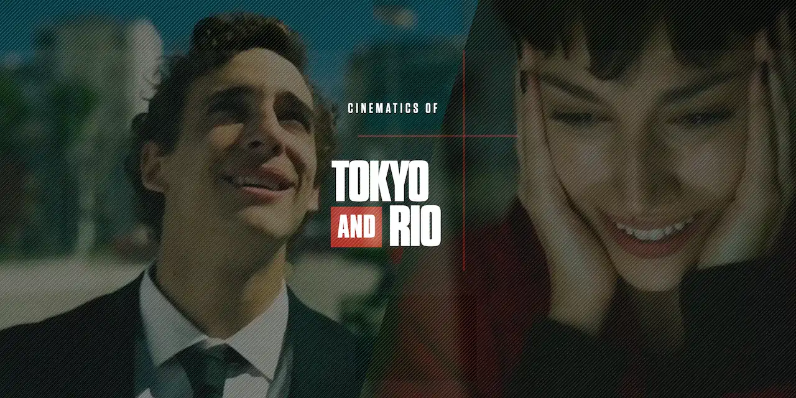

# La Casa de Papel HTML5 cinematics

Web cinematics inspired from [La Casa de Papel](https://www.antena3.com/series/casa-de-papel/) serie (Money Heist) start credits. 
[Launch](https://olivier3lanc.github.io/folio-casa-de-papel)

# Tokyo and Rio cinematics

Web cinematics inspired from the TV serie [La Casa de Papel](https://www.antena3.com/series/casa-de-papel/) Season 3 Episode 6. [Launch](https://olivier3lanc.github.io/folio-casa-de-papel/tokyorio.html)

# Credits

Boths project are only for demo and fun purpose.

## Soundtracks
*   [My Life is Going On](https://www.youtube.com/watch?v=F1oHBcTdKL4)
    by [Cecilia Krull](https://en.wikipedia.org/wiki/Cecilia_Krull)

    Digital Minds Ltd-srav, SME, WMG, JustEnte - International, We Are Era Music, Kontor Records, Altafonte
    Network S.L. (au nom de Mostiko); UNIAO BRASILEIRA DE EDITORAS DE MUSICA - UBEM, LatinAutorPerf, SODRAC,
    LatinAutor, LatinAutor - UMPG, ASCAP, Reel Muzik Werks, LLC, Abramus Digital et 12 sociétés de gestion des
    droits musicaux
*   [Broken Coastline](https://www.youtube.com/watch?v=kLtu7bc1Huo)
    by [Down Like Silver](https://www.downlikesilver.com)

    Written by Peter Bradley Adams and Caitlin Canty |
    Peter Bradley Adams - Vocals, Guitar, Keys |
    Caitlin Canty - Vocals |
    Michael Rinne - Upright Bass |
    Engineered by Joshua Grange and PBA |
    Mixed by PBA |
    Mastered by Joshua Kessler |
    Photo by Caitlin Canty |
    Released June 26, 2018

## Fonts

* [Compacta Bold](https://www.fontshop.com/families/compacta)
* [Tungsten SemiBold](https://www.typography.com/fonts/tungsten/styles/tungsten)
## Stylesheets

* BRIKS
* [normalize.css](https://necolas.github.io/normalize.css/)

## Javascript

* [Ola.js](https://github.com/franciscop/ola)
* [ScrollBtween.js](https://github.com/olivier3lanc/Scroll-Btween)
* [ScrollFrames.js](https://github.com/olivier3lanc/Scroll-Frames)

## Making of

1. All embedded texts were removed from frames - using masks and timeline - and extracted with high quality in [Adobe Photoshop](https://www.adobe.com/fr/products/photoshop.html)
2. All series of frames were highly compressed in [WebP](https://en.wikipedia.org/wiki/WebP)
